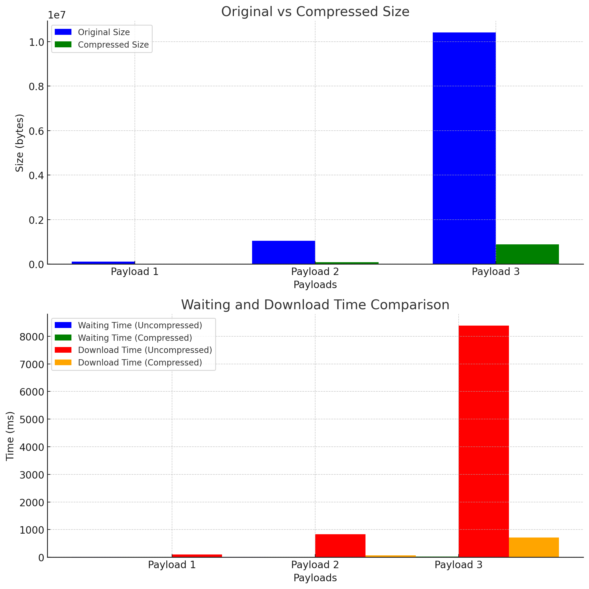
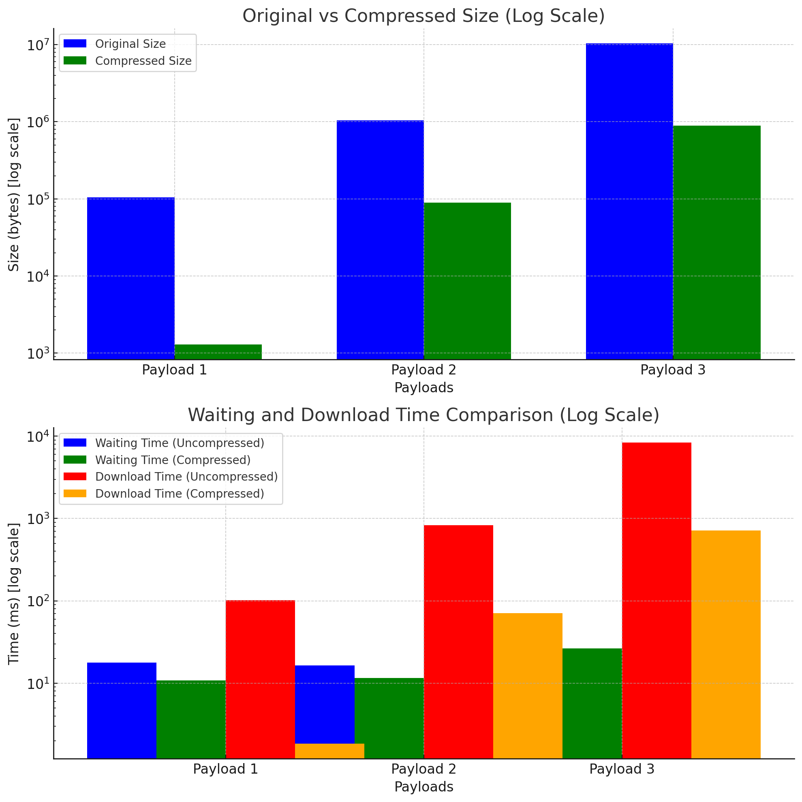
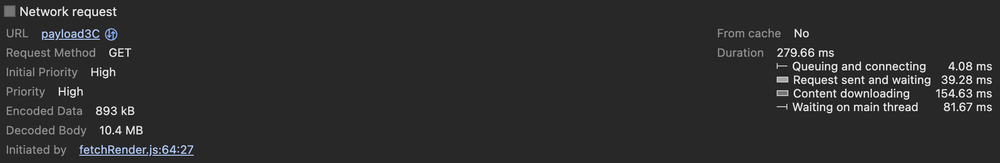
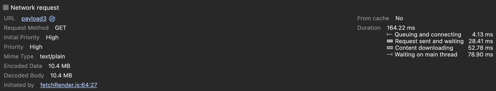

# Gzips stats

## Payload Stats

| Payload   | Original Size (bytes) | Compressed Size (bytes) | Compression Ratio |
|-----------|-----------------------|-------------------------|-------------------|
| Payload 1 | 104,182                | 1,295                   | 80.44              |
| Payload 2 | 1,041,642              | 88,982                  | 11.71              |
| Payload 3 | 10,417,662             | 889,883                 | 11.71              |

## Test Results

### Throttling: 10000kbit/s, Latency: 15ms

| Payload   | Compression  | Payload Size | Waiting for Server | Content Download  |
|-----------|--------------|--------------|--------------------|-------------------|
| Payload 1 | Not Compressed | 104 KB       | 17.84 ms           | 102.07 ms         |
|           | Compressed    | 1.5 KB       | 10.75 ms           | 1.84 ms           |
| Payload 2 | Not Compressed | 1.0 MB       | 16.4 ms            | 832.72 ms         |
|           | Compressed    | 89.5 KB      | 11.53 ms           | 71.06 ms          |
| Payload 3 | Not Compressed | 10.4 MB      | 35.42 ms           | 8.39 s            |
|           | Compressed    | 893 KB       | 26.28 ms           | 712.01 ms         |

## Plots

### Size Comparison

### Waiting and Download Time Comparison ( Log graph )

### Compression Overhead Results ( NOTE: 0 network throttling 1600~ MBPS )

#### Overall

| From Cache | Duration   |
|------------|------------|
| No         | 279.66 ms  |

#### Breakdown of Duration

| Stage                         | Time (ms) |
|-------------------------------|-----------|
| Queuing and Connecting        | 4.08      |
| Request Sent and Waiting      | 39.28     |
| Content Downloading           | 154.63    |
| Waiting on Main Thread        | 81.67     |

### No Compression Results

#### Overall

| From Cache | Duration   |
|------------|------------|
| No         | 164.22 ms  |

#### Breakdown of Duration

| Stage                         | Time (ms) |
|-------------------------------|-----------|
| Queuing and Connecting        | 4.13      |
| Request Sent and Waiting      | 28.41     |
| Content Downloading           | 52.78     |
| Waiting on Main Thread        | 78.90     |

## Worst Case

~60% compression, random data, small payload

### Throttling: 10000kbit/s, Latency: 15ms

| Payload    | Compression     | Payload Size | Waiting for Server | Content Download  |
|------------|------------------|--------------|--------------------|-------------------|
| Small Payload| Not Compressed    | 10.42 KB     | 17.18 ms           | 8.97 ms           |
|            | Compressed       | 6.63 KB      | 17.59 ms           | 8.45 ms           |

### Compressed

#### Overall

| From Cache | Duration   |
|------------|------------|
| No         | 22.60 ms   |

#### Breakdown of Duration

| Stage                         | Time (ms) |
|-------------------------------|-----------|
| Queuing and Connecting        | 1.29      |
| Request Sent and Waiting      | 16.13     |
| Content Downloading           | 4.88      |
| Waiting on Main Thread        | 0.29      |

### Not Compressed

#### Overall

| From Cache | Duration   |
|------------|------------|
| No         | 27.85 ms   |

#### Breakdown of Duration

| Stage                         | Time (ms) |
|-------------------------------|-----------|
| Queuing and Connecting        | 1.48      |
| Request Sent and Waiting      | 17.61     |
| Content Downloading           | 8.42      |
| Waiting on Main Thread        | 0.33      |
